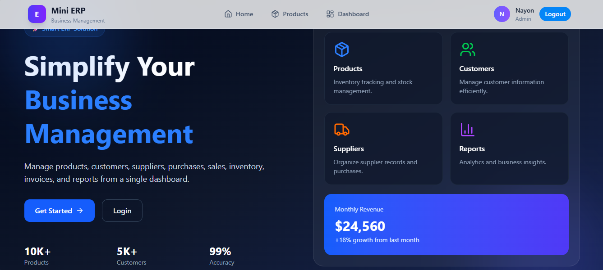
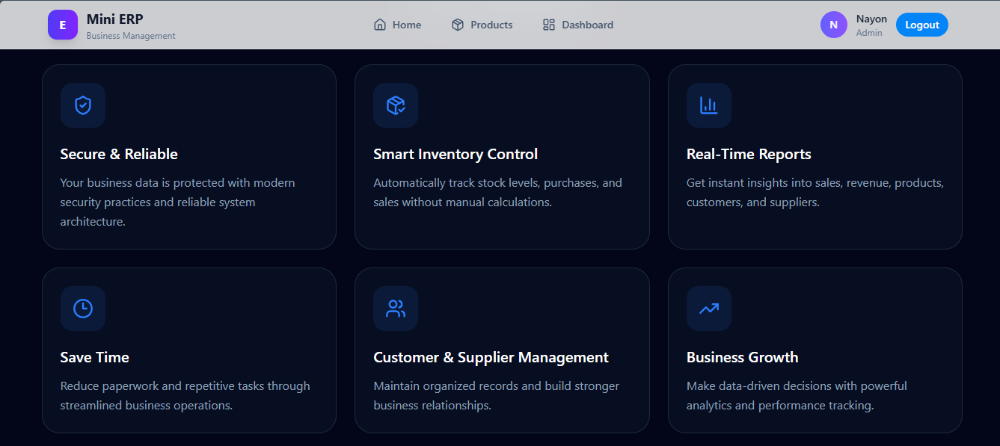
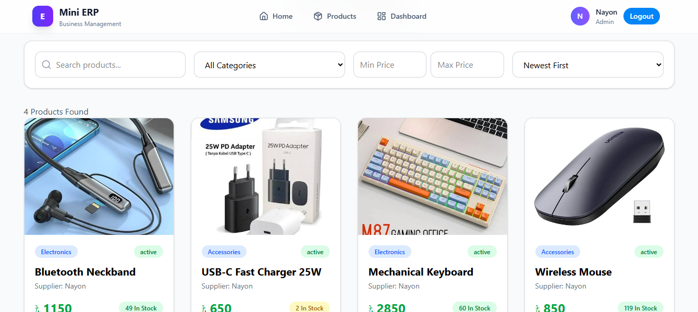
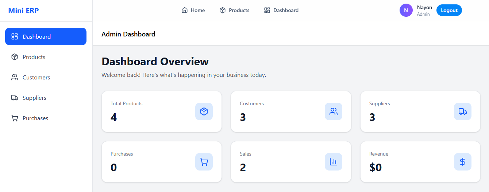
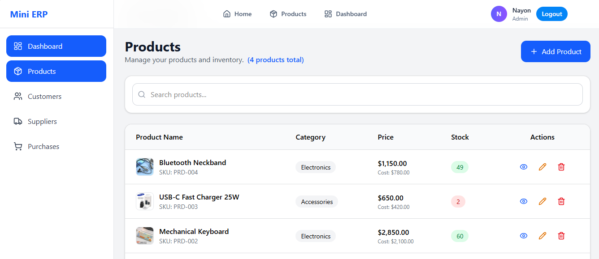
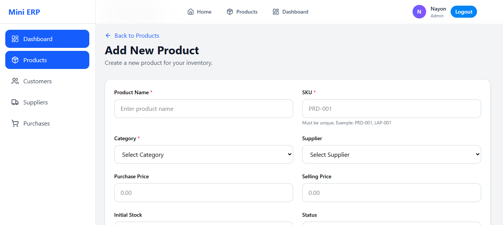
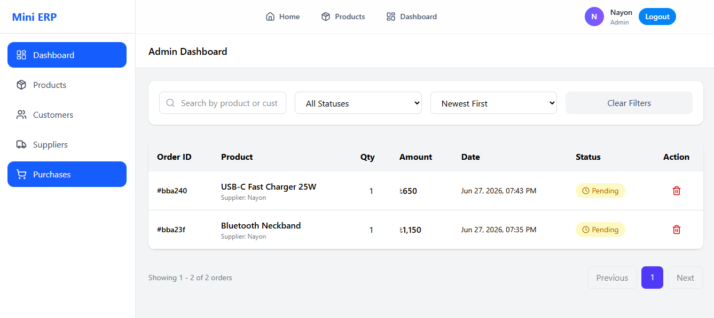

# 📊 Mini ERP - A modern ERP solution

A modern **ERP solution** for managing products, customers, suppliers, purchases, sales, inventory, invoices, and business reports through a centralized dashboard.

---

## 🌐 Live Demo

👉 https://mini-erp-client.vercel.app/

---

## 🔑 Demo Credentials

Use the following credentials to explore the application without creating a new account.

| Role        | Email                 | Password       |
| ----------- | --------------------- | -------------- |
| 👑 Admin    | `admin@gmail.com`     | `Admin@123`    |
| 👨‍💼 Customer | `customer1@gmail.com` | `Customer@123` |
| 👤 Supplier | `supplier1@gmail.com` | `Supplier@123` |

> **Note:** These are demo accounts intended for testing purposes only.

---

## 📸 Screenshots

##### Home

  

##### Why Choose Us

  

##### Products

  

##### Admin Dashboard

  

##### Products

  

##### Add New Products

  

##### Purchaser

  

